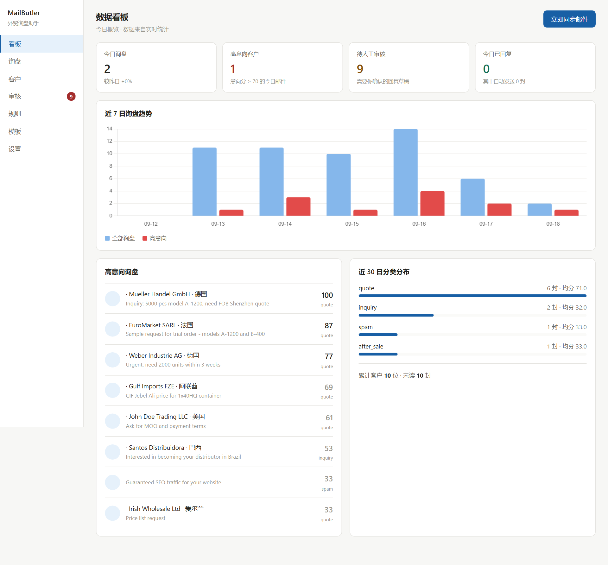
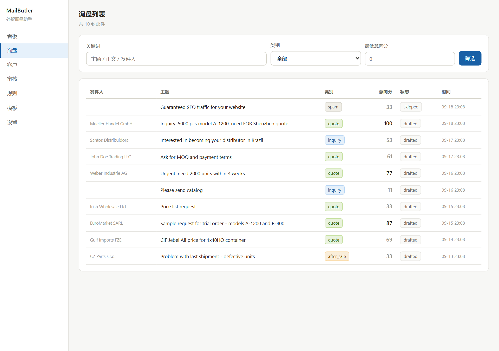
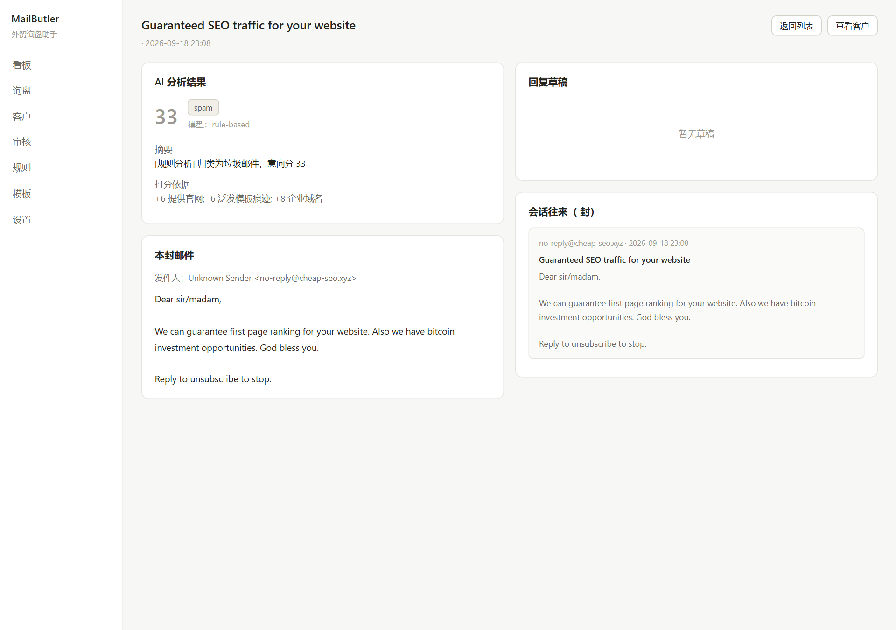
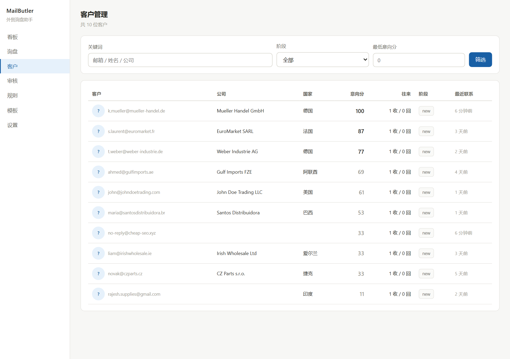
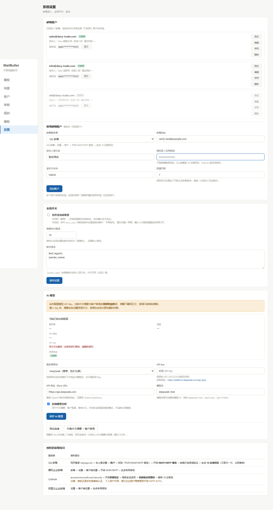
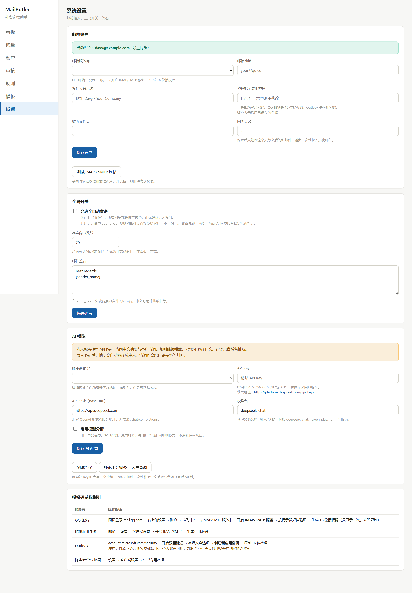
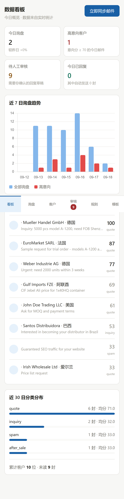
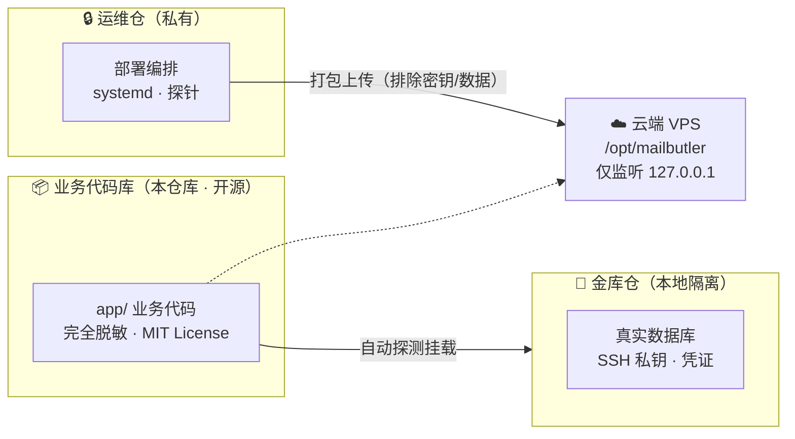
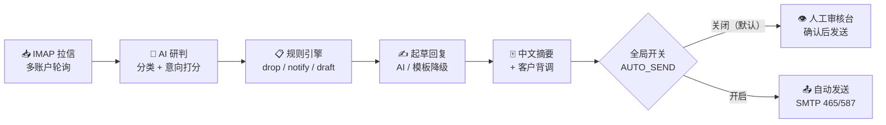

<div align="center">

# 外贸询盘助手 (MailButler)

**面向外贸制造与出口企业的智能询盘处理系统**

AI 研判 · 自动回复 · 客户画像 · 商业单证 · 订单管理

[中文](README.md) | [English](README_EN.md)

`Python` `FastAPI` `SQLite` `DeepSeek` `IMAP/SMTP`

</div>

---

> 📮 **反馈与贡献**：运行中遇到 Bug、有功能建议或想贡献代码，欢迎提交 [Issue](https://github.com/Davyricardo/waimao-inquiry-assistant/issues) 或 Pull Request，我会尽快处理。
>
> 🔓 **开源声明**：本仓库为**业务代码主仓库**，已完成脱敏，可安全开源（MIT License）。真实的客户数据、部署私钥与凭证存放在独立的保密金库（不公开），云端的部署运维脚本位于私有仓库。你克隆本仓库后按下方步骤即可完整跑通。

---

## 📸 项目截图

### 数据看板


### 询盘列表（AI 自动分类与意向打分）


### 邮件详情（AI 分析 + 中文摘要 + 回复草稿）


### 客户管理（自动归并联系人 + 意向分）


### 多邮箱账户管理（授权码加密存储、打码显示）


### AI 模型配置（支持 DeepSeek / OpenAI / 百炼 / Kimi / GLM）


### 移动端适配
<p align="center">
  
</p>

---

## 🏗️ 系统架构

### 三库隔离架构

业务代码、云端运维与商业数据三向隔离，保证商业机密与生产数据安全：



### 邮件处理流水线



---

## 核心特性

- **询盘智能研判与回复**：对接 DeepSeek / 商业大模型，自动解析外贸询盘意向分值、产品特征与采购需求，生成专业中英文商务回复；
- **全链路客户与商机管理**：支持客户跟进记录、社媒开发潜客追踪、多触点沉淀与客户画像标签；
- **外贸单证与报价自动化**：自主产品库管理，一键生成出口商业发票 (Commercial Invoice)、形式发票 (PI)、装箱单 (Packing List) 及货代多维比价单；
- **外贸公司独立管理**：独立维护外贸出口公司抬头信息、境内外收款银行账户与外汇结算账户；
- **多账户与自动化轮询**：多邮箱 IMAP/SMTP 异步收发与轮询，安全凭证加密存储。

## 安全设计

| 维度 | 实现 |
|------|------|
| 凭据加密 | 邮箱授权码 AES-256-GCM 加密入库，页面打码显示 |
| 密码存储 | 管理员密码 PBKDF2-HMAC-SHA256（60 万次迭代）加盐哈希 |
| 网络隔离 | 后台仅监听 `127.0.0.1`，经 SSH 隧道访问，公网不可达 |
| 应用安全 | CSRF 防护 + 登录失败限速 + HMAC 签名 Cookie + 安全响应头 |
| 邮件通道 | SMTP 仅走 465/587 认证提交，绝不用 25 端口裸发 |
| 安全阀 | `AUTO_SEND` 默认关闭，自动回复强制降级为人工审核 |
| 数据隔离 | 三库隔离架构，代码库不含任何真实数据与密钥 |

---

## 本地快速开始

### 1. 安装 Python 依赖
```bash
python -m venv .venv
# Windows:
.venv\Scripts\activate
# Linux/macOS:
source .venv/bin/activate

pip install -r requirements.txt
```

### 2. 配置环境变量
- **推荐（三库架构）**：保持同级目录存在 `外贸询盘助手-保密数据/`，程序启动时会自动寻找并挂载金库配置与数据库，实现零配置直连；
- **独立运行模式**：复制示例配置文件并根据需要修改：
  ```bash
  cp .env.example .env
  ```

### 3. 初始化与启动
```bash
# 生成初始化表结构与演示数据（可选）
python init.py
python seed_demo.py

# 启动 Web 服务
python serve.py
```
启动后访问本地控制台：[http://127.0.0.1:8090](http://127.0.0.1:8090)

---

## 自动化测试

项目内置完整的自动化回归测试套件（440+ 项断言）：
```bash
python selftest.py                 # 核心流与引擎自测
python selftest_accounts.py        # 邮箱账户与凭据加密测试
python selftest_ai.py              # AI 研判与规则自测
python test_social_outreach.py     # 社媒潜客流测试
python test_freight.py             # 货运代理与比价测试
python test_orders.py              # 订单流水与品项测试
python test_products_and_docs.py   # 产品库与单证生成测试
python test_company_flow.py        # 公司管理与银行账户测试
```

---

## 📮 问题反馈

- 🐛 **发现 Bug** → 提交 [Issue](https://github.com/Davyricardo/waimao-inquiry-assistant/issues/new)，附上复现步骤与日志；
- 💡 **功能建议** → 也走 Issue，打上 `enhancement` 标签；
- 🔒 **安全问题** → 请勿公开披露，通过 Issue 私下联系或邮件反馈。

## License

[MIT](LICENSE) © 2026 Davyricardo
