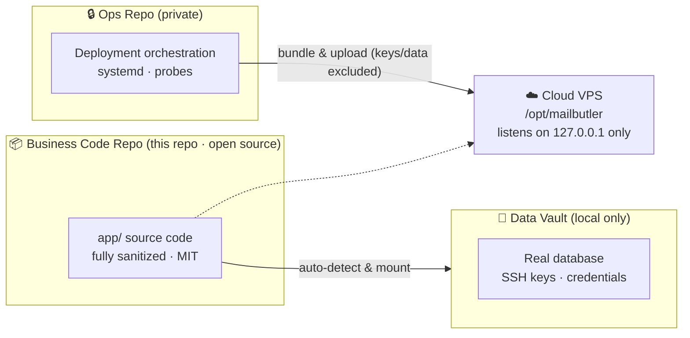
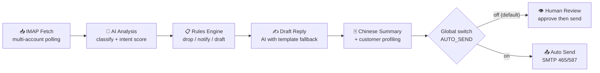

<div align="center">

# MailButler — Foreign Trade Inquiry Assistant

**AI-powered inquiry processing for foreign trade manufacturers & exporters**

Intent Scoring · Auto Reply · Customer Profiling · Trade Documents · Order Management

[中文](README.md) | [English](README_EN.md)

`Python` `FastAPI` `SQLite` `DeepSeek` `IMAP/SMTP`

</div>

---

> 📮 **Feedback & Contributing**: Found a bug, have a feature request, or want to contribute? Please open an [Issue](https://github.com/Davyricardo/waimao-inquiry-assistant/issues) or a Pull Request — I'll get back to you as soon as I can.
>
> 🔓 **Open Source Statement**: This is the **main business-code repository**, fully sanitized and safe to publish (MIT License). Real customer data, deployment keys and credentials live in a separate local vault (not public), and the cloud deployment scripts live in a private repository. Clone this repo and follow the steps below to get it running end to end.

---

## 📸 Screenshots

### Dashboard


### Inquiry List (AI auto-classification & intent scoring)


### Message Detail (AI analysis + Chinese summary + reply draft)


### Contact Management (auto-merged contacts + intent score)


### Multi-Mailbox Management (encrypted & masked credentials)


### AI Model Configuration (DeepSeek / OpenAI / DashScope / Kimi / GLM)


### Mobile
<p align="center">
  
</p>

---

## 🏗️ Architecture

### Three-Repo Isolation

Business code, cloud operations and business data are strictly isolated to protect trade secrets and production data:



### Mail Processing Pipeline



---

## Features

- **AI-powered inquiry analysis & replies**: integrates DeepSeek / LLMs to score buyer intent, extract product attributes and procurement needs, and generate professional business replies in English and Chinese;
- **Full-funnel customer & opportunity management**: follow-up records, social-media prospecting, multi-touchpoint tracking and customer profile tags;
- **Trade documents & quotation automation**: self-managed product catalog; one-click generation of Commercial Invoice, Proforma Invoice (PI), Packing List, and multi-dimension forwarder comparison;
- **Independent company profiles**: manage export company letterheads, domestic & overseas bank accounts and FX settlement accounts;
- **Multi-account & automated polling**: asynchronous IMAP/SMTP send/receive across multiple mailboxes with encrypted credential storage.

## Security Design

| Aspect | Implementation |
|--------|----------------|
| Credential encryption | Mailbox tokens encrypted with AES-256-GCM, masked in UI |
| Password storage | Admin password hashed with PBKDF2-HMAC-SHA256 (600k iterations) |
| Network isolation | Admin console listens on `127.0.0.1` only, accessed via SSH tunnel |
| Application security | CSRF protection + login throttling + HMAC-signed cookies + security headers |
| Mail channel | SMTP via authenticated submission on 465/587 only — never raw port 25 |
| Safety valve | `AUTO_SEND` off by default; auto-reply downgraded to human review |
| Data isolation | Three-repo architecture; zero real data or secrets in the code repo |

---

## Quick Start

### 1. Install dependencies
```bash
python -m venv .venv
# Windows:
.venv\Scripts\activate
# Linux/macOS:
source .venv/bin/activate

pip install -r requirements.txt
```

### 2. Configure environment
- **Recommended (vault mode)**: keep a sibling directory `外贸询盘助手-保密数据/` (data vault); the app auto-detects and mounts its config & database at startup;
- **Standalone mode**: copy the example config and edit as needed:
  ```bash
  cp .env.example .env
  ```

### 3. Initialize & run
```bash
# Create schema and (optionally) demo data
python init.py
python seed_demo.py

# Start the web server
python serve.py
```
Then open the local console at: [http://127.0.0.1:8090](http://127.0.0.1:8090)

---

## Automated Tests

A full regression suite with 440+ assertions ships with the project:
```bash
python selftest.py                 # Core flows & engine
python selftest_accounts.py        # Mailbox accounts & credential encryption
python selftest_ai.py              # AI analysis & rules
python test_social_outreach.py     # Social-media prospecting
python test_freight.py             # Forwarder comparison
python test_orders.py              # Order pipeline
python test_products_and_docs.py   # Product catalog & documents
python test_company_flow.py        # Company profiles & bank accounts
```

---

## 📮 Issues

- 🐛 **Bug reports** → open an [Issue](https://github.com/Davyricardo/waimao-inquiry-assistant/issues/new) with reproduction steps and logs;
- 💡 **Feature requests** → same place, tagged `enhancement`;
- 🔒 **Security issues** → please do NOT disclose publicly; contact privately via Issue or email.

## License

[MIT](LICENSE) © 2026 Davyricardo
